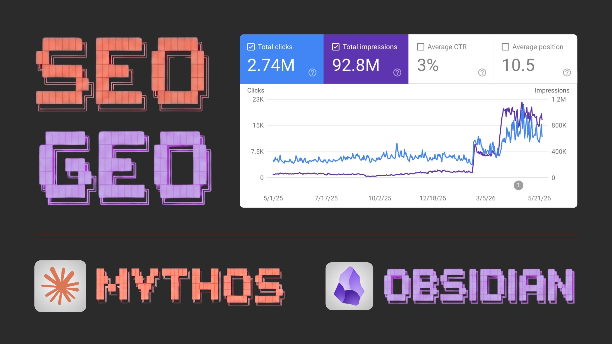
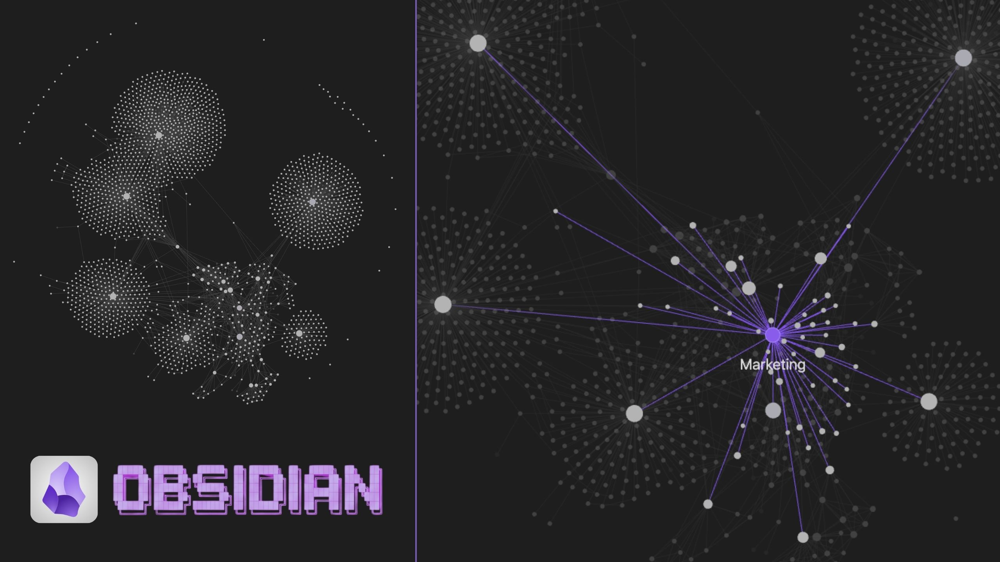
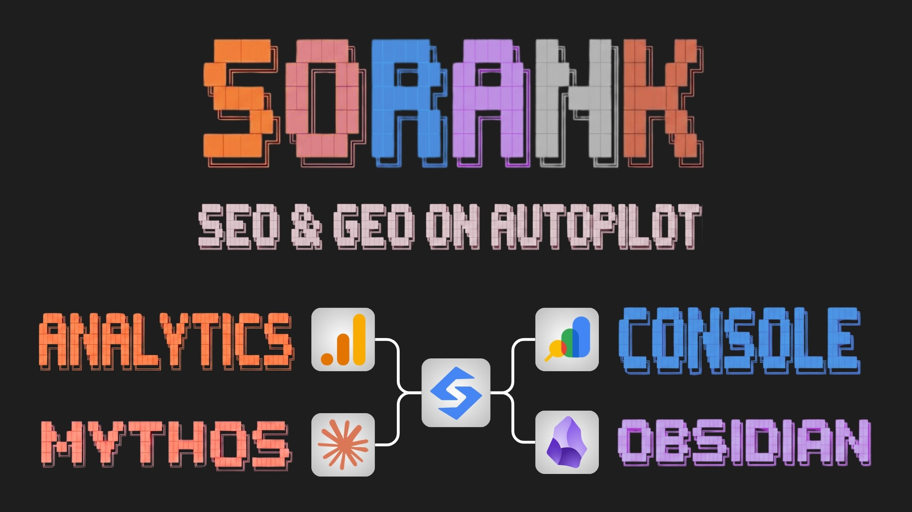

<p align="center"></p>

# Claude SEO GEO

**SEO & GEO skills for Claude Code, built with Claude Mythos 5.** Rank in Google AND in LLMs like ChatGPT, Perplexity, and Gemini. Technical audits, backlink strategy, AI-optimized content, local visibility, and social amplification: everything you need to own search as it evolves. What took weeks now happens in hours. The future of Search is here, for free.

15 skills. Zero dependencies. Every claim sourced. Built from 115+ real agency audit calls and the 2026 evidence on AI search.

## Run it on your company's second brain

<p align="center"></p>

[Obsidian](https://obsidian.md) is a free note-taking app that stores your notes as plain text files on your own computer and links them into a graph, the network you see above. Because the notes are plain markdown, Claude reads and writes them natively, and your data never leaves your machine.

That makes a vault the perfect second brain for SEO. Claude is the uranium: raw reasoning power, in unlimited supply. Your company's knowledge is what that power runs on. A local Obsidian vault is the power plant: the infrastructure that turns the two into compounding output. Dump everything your business knows into plain markdown notes (PDFs, pitch decks, call and video transcripts, exports: every format Claude reads), and every skill in this kit will pull that context before acting, then log its actions back to the vault. Each session starts where the last one ended, smarter. Setup in minutes with the [obsidian-brain](skills/obsidian-brain/SKILL.md) skill.

## Why SEO and GEO in one toolkit?

Generative Engine Optimization (GEO) is not a replacement for SEO: AI engines pull from search indexes, so a page that is not indexed is cited nowhere. But ranking is no longer the bottleneck either. Google AI Mode answers overlap the top 10 organic results on only about 32 percent of URLs, and ChatGPT cites pages well beyond classic rankings when their passages answer the question better.

That is why every skill in this repository works both layers at once. The content skills produce pages that rank on Google and read like citable passages to LLMs. The technical skill covers crawl budget and Core Web Vitals next to AI crawler access and JavaScript rendering. The backlinks skill builds links for Google and brand mentions for AI answers, because mentions correlate about 3 times more with AI visibility than backlinks do.

## Install

Claude Code plugin (recommended):

```
/plugin marketplace add Thibaultbm/claude-seo-geo
/plugin install claude-seo-geo@sorank
```

With the skills CLI:

```
npx skills add Thibaultbm/claude-seo-geo
```

Manual copy:

```
git clone --depth 1 https://github.com/Thibaultbm/claude-seo-geo.git
cp -r claude-seo-geo/skills/* ~/.claude/skills/
```

The skills are plain markdown following the open Agent Skills format, so they also work in Cursor, Codex, Gemini CLI and any agent that reads instructions from disk. See [AGENTS.md](AGENTS.md).

## The skills

| Skill | What it does |
|---|---|
| [obsidian-brain](skills/obsidian-brain/SKILL.md) | The knowledge layer: an Obsidian vault holding all company data, read by every skill before acting, updated with an SEO action log after |
| [seo-geo-audit](skills/seo-geo-audit/SKILL.md) | Full site audit: 14 categories, facts collected by a bundled zero-dependency script, prioritized action plan or plain-language email |
| [seo-technical](skills/seo-technical/SKILL.md) | Crawlability, indexation, Core Web Vitals, JavaScript rendering, AI crawler access (the canonical crawler table), migrations |
| [seo-keyword-research](skills/seo-keyword-research/SKILL.md) | Real queries over jargon, intent mapping, cannibalization, and AI prompt research (the keyword research of answer engines) |
| [seo-content-blog](skills/seo-content-blog/SKILL.md) | The 12-element article skeleton: answer-first summary, sources, FAQ, internal links, citable passages |
| [seo-content-product-page](skills/seo-content-product-page/SKILL.md) | Product pages that rank and get recommended by AI assistants, plus the ChatGPT Shopping feed |
| [seo-content-service-page](skills/seo-content-service-page/SKILL.md) | The proven service page wireframe, city pages, E-E-A-T signals |
| [seo-content-collection-page](skills/seo-content-collection-page/SKILL.md) | Category and collection pages: the 400-800 word bottom text, faceted navigation, pagination |
| [seo-internal-linking](skills/seo-internal-linking/SKILL.md) | Money-page-first linking, silos, orphan pages, anchors |
| [seo-schema-markup](skills/seo-schema-markup/SKILL.md) | The structured data that still matters in 2026, with ready JSON-LD templates (and the markup that died) |
| [seo-backlinks](skills/seo-backlinks/SKILL.md) | Link building strategy, ninja linking with a spot catalog, digital PR, unlinked brand mentions |
| [seo-local](skills/seo-local/SKILL.md) | Google Business Profile, reviews, NAP citations, local pages |
| [social-amplification](skills/social-amplification/SKILL.md) | Repurpose and distribute content across YouTube, Reddit, LinkedIn and X to drive branded search and feed the surfaces AI engines cite |
| [geo-visibility](skills/geo-visibility/SKILL.md) | How each AI engine picks sources, passage-level citability, the 5-pillar GEO score, entity consistency |
| [geo-tracking](skills/geo-tracking/SKILL.md) | GA4 AI channel setup, monthly prompt panels, server log signals, share of voice reporting |

## Quick start

Ask Claude things like:

```
Audit https://example.com and tell me what to fix first.
Why does my site never get mentioned by ChatGPT?
Write the collection page text for our "linen dresses" category.
Build a link acquisition plan for a B2B SaaS in the HR space.
Set up AI traffic tracking in GA4 and a monthly prompt panel.
```

The right skill triggers on its own. For a full review, start with `seo-geo-audit`: it collects facts with the bundled script, judges them against the field checklist, and hands each fix to the specialized skill.

## One-click audits in the browser (free Chrome extension)

Not every check needs a terminal. [Sorank SEO & GEO Audit](https://chromewebstore.google.com/detail/sorank-seo-geo-audit/fiaifciaeodokchkkgjndmmjpelkcbpb) is a 100 percent free Chrome extension (rated 5.0, 1000+ users, 25 languages) that analyzes the page you are visiting in one click: an SEO score 0-100 with letter grade, a GEO score built on the same 5-pillar rubric as the [geo-visibility](skills/geo-visibility/SKILL.md) skill, PageSpeed and Core Web Vitals, the heading tree, image and link audits, robots.txt access for 25+ AI crawlers, and an AI crawler view that shows the page the way ChatGPT sees it. Reports export to PDF, JSON or CSV, and everything runs client-side in your browser.

It fits agencies and freelancers who audit client sites all day, and it fits completely non-technical site owners who want the diagnosis in plain language. Use the extension for the instant check, and these skills when it is time to apply the fixes.

## What makes this different

1. Field-tested, not theoretical. The audit checklist and thresholds were distilled from 115+ real agency audit calls: the 200 KB image rule, the word ladder, the one-intent-one-page doctrine, the collection page bottom text. Where a rule is a field heuristic rather than a measured fact, it says so.
2. Every skill has a GEO layer. Other skill packs treat AI search as one skill among many. Here, product pages, collections, schema, backlinks and local each explain how they affect ChatGPT, Perplexity and AI Overviews, with the canonical crawler and citability references shared across skills.
3. Sourced and honest. Claims carry their study or official documentation. Dead tactics are called dead: FAQ rich results are gone, llms.txt has no confirmed reader, blocking Google-Extended does not remove a site from AI Overviews, PBNs get footprint-detected. No skill here will sell you a placebo.
4. Covers what others skip. Operational link acquisition (not just profile analysis), e-commerce collection pages, AI prompt research, social content repurposing, and a share-of-voice tracking protocol that costs nothing.
5. Zero dependencies. One optional Python script, standard library only. No API keys, no venv, no paid tool required to get value. Paid tools are mentioned where they help, as options.

## FAQ

### Does Google penalize AI-generated content?

No. Google penalizes thin, lazy, unhelpful content regardless of who typed it. The blog skill enforces the workflow that keeps AI-assisted content safe: read what already ranks, add information gain (original data, first-hand experience), source every claim, and structure for humans.

### What is GEO exactly?

Generative Engine Optimization: making a brand and its pages retrievable, quotable and actually quoted in AI-generated answers (ChatGPT, Perplexity, Google AI Overviews and AI Mode, Claude). It shares foundations with SEO (indexation, crawlability) and adds passage-level citability, entity consistency, per-engine surfaces and its own measurement.

### Do AI crawlers execute JavaScript?

No. None of them render JavaScript; only Googlebot does (which feeds Gemini and AI Overviews). Content that exists only after client-side rendering is invisible to ChatGPT, Claude and Perplexity. This single fact disqualifies more sites from AI answers than any other, and the audit checks it first.

### Is llms.txt worth doing?

It costs ten minutes and does no harm, but no major engine confirms reading it (it shows up in roughly 0.1 percent of AI bot hits in published log studies). Generate one if you like; never prioritize it over indexation, rendering or content. Anyone selling llms.txt as a ranking lever is selling a placebo.

### Why connect an Obsidian vault?

Because generic context produces generic SEO. A local vault of plain markdown notes holds your brand facts, customer language, keyword map and the log of every SEO action already taken. The skills read it before acting (so they stop asking you for facts you already wrote down) and append their actions after (so the next session starts informed). Your data stays local, in files you own.

### Will this work for my non-English site?

Yes. The methodology is language-agnostic and the audit skill writes its deliverable in the language of the site. Language matching is itself part of the method (links and content in the market's language).

### Do I need paid SEO tools?

No. Everything runs on free surfaces: the bundled script, Google Search Console, Bing Webmaster Tools, PageSpeed Insights, autocomplete and People Also Ask, GA4, server logs. Paid indexes (Ahrefs, Semrush, Moz, DataForSEO) are referenced as optional accelerators only.

### How is the 115+ audit calls claim verifiable?

The checklist is the distilled output of real audit calls conducted by the maintainer's team between 2025 and 2026 across e-commerce, SaaS, local and service businesses. The heuristics that come from this corpus are explicitly labeled (field) in the references, separate from (measured) claims that carry public sources.

## Prefer the done-for-you version?

These skills give you full manual control, and great power comes with great responsibility: one wrong redirect or an overwritten page can cost rankings that took years to build. [Sorank](https://sorank.com) applies the same methodology on autopilot: AI-first articles published straight to your site, backlinks, and AI visibility tracking across ChatGPT, Perplexity and Gemini, with your existing rankings kept safe. Hours saved every week, the method stays the same.

<p align="center"></p>

## Repository structure

```
claude-seo-geo/
  .claude-plugin/          plugin.json + marketplace.json
  skills/                  15 skills (SKILL.md + references/ + evals/)
    seo-geo-audit/
      scripts/seo_audit.py zero-dependency on-page fact collector
  scripts/                 validate_skills.py (CI format + style checks)
  AGENTS.md                using the skills outside Claude Code
```

## Contributing

Issues and pull requests are welcome: new evidence with sources, threshold corrections, new spot categories, translations of the methodology. Run `python3 scripts/validate_skills.py` before submitting; CI enforces the skill format and house style.

## About

Built and maintained by [Thibault Besson-Magdelain](https://thibaultbessonmagdelain.com), founder of [Sorank](https://sorank.com), an AI visibility and content platform. The methodology in these skills is the same one used in production: the audit checklist, the GEO scoring rubric and the prompt panel protocol all come from shipped tooling and real client work. Follow the work on [LinkedIn](https://www.linkedin.com/in/thibaultbessonmagdelain/) and [X](https://x.com/thibaultbessonm).

License: MIT.
