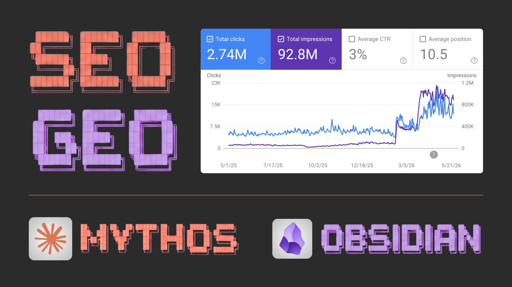
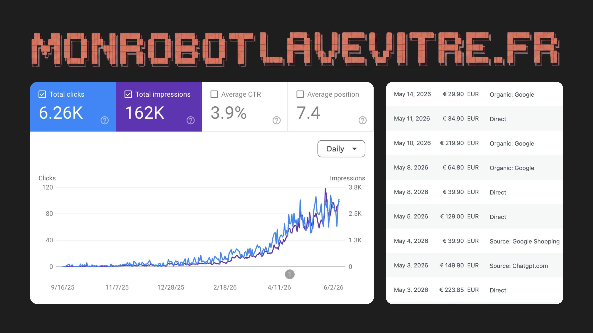
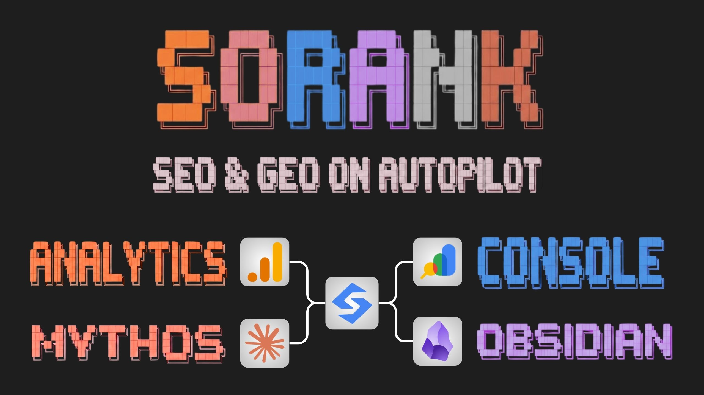

<p align="center"></p>

# Claude SEO GEO

**SEO and GEO skills that work like a specification: they audit a page, compare it with the competitors that rank, and build the fix.** Rank in Google and get cited by ChatGPT, Perplexity, Gemini and Google AI Overviews.

20 skills, 9 zero-dependency scripts, every threshold either measured (with its source) or labeled as a field heuristic from 115+ real agency audits. Free and open source.

## How a page skill works

Every skill that owns a page type (homepage and sales page, service, product, collection, comparison, blog article, local page, and the 21 types of the page sections skill) runs the same four phases, in the same order, with the same deliverable.

| Phase | Question | What runs | Output |
|---|---|---|---|
| 1. Spec | What must a page of this type contain? | The skill's specification table (stable IDs such as SVC-07) plus the 27 common requirements every page shares | The checklist |
| 2. Audit | What does the page contain today? | `seo_audit.py` (scores and findings) and `section_audit.py` (blocks present) | Every requirement marked Pass, Fail or Not verifiable |
| 3. Benchmark | What do the pages that rank, and that AI assistants cite, contain? | `page_benchmark.py` on your page and 3-5 competitor pages | Block x competitor table, the blocks most competitors have and you do not, the metrics where you sit below the median |
| 4. Build | What do we write, and when is it done? | The skill's wireframe, copy rules and JSON-LD templates | The page, then the scripts re-run as the acceptance test |

The finish line is measurable: no requirement left failing, or a written owner decision for each one that stays.

### What the benchmark looks like

```
$ python3 skills/seo-geo-audit/scripts/page_benchmark.py --type homepage \
    https://your-site.com/ https://rival-a.com/ https://rival-b.com/ https://rival-c.com/

| metric      | your-site.com | rival-a.com | rival-b.com | rival-c.com |
| words       | 847           | 1325        | 2187        | 2499        |
| seo_score   | 80            | 84          | 54          | 88          |
| bold        | 0             | 1           | 34          | 6           |
| money_links | 1             | 15          | 10          | 15          |
| schema      | -             | Organization, Person, WebSite | - | EducationalOrganization, WebSite |
...
BLOCKS half or more of the competitors have and the client does not:
  - author_block (2/3)  - guarantee (2/3)  - contact_details (2/3)
CLIENT BELOW THE COMPETITOR MEDIAN:
  - words: client 847 vs median 2187
  - bold: client 0 vs median 6
```

### Site level: crawl and decay

```
python3 skills/seo-internal-linking/scripts/site_crawl.py https://your-site.com --out crawl.json
python3 skills/seo-traffic-drop/scripts/content_decay.py --current last3m.csv --previous prev3m.csv --last-year ly3m.csv --crawl crawl.json
```

The crawl finds what no single-page audit can see (orphans, internal links pointing to redirects, cannibalization, pages buried deeper than 3 clicks). The decay finder turns three Search Console exports into a refresh queue: which pages lose traffic, why, and what to do.

### What the audit measures

`seo_audit.py` uses the same thresholds and weights as the free Sorank Chrome extension, so the terminal and the browser agree on the same page. Per page it returns an SEO score and a GEO score out of 100 and a ranked list of findings, covering:

- **Tags and head:** title and meta lengths, H1 and heading tree, canonical, Open Graph, Twitter card, viewport, lang, charset, favicon, hreflang, meta refresh, robots and snippet directives.
- **Content:** word count, bold usage, keyword density (alert above 2.5%, stuffing above 7%), the keyword placement matrix (title, H1, H2-H6, meta, URL, intro, bold, alt), readability with sentence-length buckets and Flesch, paragraph length, question headings, statistics, definitions, quotes.
- **Links:** internal and external, nofollow, sponsored and ugc, empty and generic anchors, body links to the pages that sell, social profiles and placeholder links.
- **Images:** alt coverage, alt quality, weight, format, dimensions, lazy-loading of the first image.
- **Structured data:** types found, JSON-LD that fails to parse, required properties missing or empty per type.
- **Templates:** table of contents, author block and author page link, dates, breadcrumb, CTA links, blog hub cover images.
- **Trust:** income or results promises without a disclaimer, gambling topics without the legal notice, unbacked superlatives.
- **Site level:** robots.txt rules for AI search, user-fetch and training bots, sitemap and its 50,000 URL limit, llms.txt.

## The skills

### Page skills (spec, audit, benchmark, build)

| Skill | Page it owns |
|---|---|
| [seo-content-homepage](skills/seo-content-homepage/SKILL.md) | Homepage, flagship offer or sales page, about page: 16-block order, semantic bolding, proof with numbers, objection FAQ, price, Organization, Person and Course schema |
| [seo-content-service-page](skills/seo-content-service-page/SKILL.md) | Service and landing pages, city and region pages |
| [seo-content-product-page](skills/seo-content-product-page/SKILL.md) | E-commerce product pages, the ChatGPT Shopping feed |
| [seo-content-collection-page](skills/seo-content-collection-page/SKILL.md) | Category and collection pages: the text zones, facets, pagination |
| [seo-content-comparison-page](skills/seo-content-comparison-page/SKILL.md) | X vs Y, alternatives, best-for lists, customer segment pages |
| [seo-content-blog](skills/seo-content-blog/SKILL.md) | Articles on the 12-element skeleton, plus the page templates: sticky table of contents, author box with photo and social profiles, CTA blocks, blog hub cards with covers |
| [seo-local](skills/seo-local/SKILL.md) | Local pages and the Google Business Profile, reviews, citations |
| [seo-page-sections](skills/seo-page-sections/SKILL.md) | Any other page type (21 in total) and the site-level question "which pages and blocks are missing" |

### Site skills

| Skill | Use it for |
|---|---|
| [seo-geo-audit](skills/seo-geo-audit/SKILL.md) | Full site audit, 15 categories, SEO and GEO scores, a prioritized plan that hands each fix to the right skill |
| [seo-traffic-drop](skills/seo-traffic-drop/SKILL.md) | Traffic or rankings fell: date the drop, locate it, run the differential diagnosis |
| [seo-technical](skills/seo-technical/SKILL.md) | Crawl, indexation, Core Web Vitals, JavaScript rendering, AI crawler access, migrations |
| [seo-ai-site-builders](skills/seo-ai-site-builders/SKILL.md) | Sites built by Lovable, Base44, Bolt, v0, Bubble and others: turn the JavaScript app into served HTML |
| [seo-keyword-research](skills/seo-keyword-research/SKILL.md) | Real queries, intent mapping, cannibalization, AI prompt research |
| [seo-internal-linking](skills/seo-internal-linking/SKILL.md) | Money-page-first linking, silos, orphan pages, anchors |
| [seo-schema-markup](skills/seo-schema-markup/SKILL.md) | The structured data that still earns surfaces, ready JSON-LD templates, the markup Google retired |

### Authority, AI visibility and distribution

| Skill | Use it for |
|---|---|
| [seo-backlinks](skills/seo-backlinks/SKILL.md) | Link building, ninja linking, digital PR, unlinked brand mentions |
| [geo-visibility](skills/geo-visibility/SKILL.md) | How each AI engine picks sources, passage citability, the GEO score, entity consistency |
| [geo-tracking](skills/geo-tracking/SKILL.md) | AI traffic in GA4, monthly prompt panels, share of voice |
| [social-amplification](skills/social-amplification/SKILL.md) | Repurpose content for YouTube, Reddit, LinkedIn and X to drive branded search and AI citations |
| [obsidian-brain](skills/obsidian-brain/SKILL.md) | Optional: a local knowledge base of company facts that every skill reads before acting and logs to after |

## The scripts

All standard-library Python 3.9+, read only, no API key, no install.

| Script | What it does |
|---|---|
| `skills/seo-geo-audit/scripts/seo_audit.py` | Per page: SEO and GEO scores, ranked findings, every fact listed above; site-level robots, sitemap, llms.txt |
| `skills/seo-geo-audit/scripts/page_benchmark.py` | Your page against 3-5 competitor pages: one table, block gaps, schema gaps, metrics below the median, and the vocabulary gap (terms and phrases half the competitors use and you never do, with the headings that carry them) |
| `skills/seo-internal-linking/scripts/site_crawl.py` | Crawls the whole site from the homepage: orphans, click depth, weak inbound links, broken links and redirects, duplicate titles, meta and H1, thin pages, cannibalization candidates, generic anchors, stale pages, sitemap entries that should not be there |
| `skills/seo-traffic-drop/scripts/content_decay.py` | From Search Console exports: the pages slowly losing clicks, classified as ranking loss, CTR loss, demand loss or seasonal, stale pages first, with the action for each |
| `skills/seo-page-sections/scripts/section_audit.py` | Which blocks a page has (FAQ, breadcrumb, comparison table, reviews, guarantee, process, author...) |
| `skills/seo-ai-site-builders/scripts/render_check.py` | What crawlers receive from a JavaScript site, by user agent, plus a soft-404 probe |
| `skills/seo-traffic-drop/scripts/gsc_diff.py` | Locates a traffic drop in Search Console exports |
| `skills/obsidian-brain/scripts/link_graph.py`, `person_matches.py` | Vault link audit |

## Install

Claude Code plugin (recommended):

```
/plugin marketplace add Thibaultbm/claude-seo-geo
/plugin install claude-seo-geo@sorank
```

With the skills CLI:

```
npx skills add Thibaultbm/claude-seo-geo
```

Manual copy:

```
git clone --depth 1 https://github.com/Thibaultbm/claude-seo-geo.git
cp -r claude-seo-geo/skills/* ~/.claude/skills/
```

The skills are plain markdown in the open Agent Skills format, so they also work in Cursor, Codex, Gemini CLI and any agent that reads instructions from disk. See [AGENTS.md](AGENTS.md).

## Quick start

```
Audit the service page https://example.com/seo-agency-lyon against the 3 pages that rank, then rewrite it.
Our homepage has no bold, no proof and a generic FAQ. Benchmark our competitors and rebuild it.
Our blog has no author box, no table of contents and no covers on the hub. Fix the templates.
Audit https://example.com and tell me what to fix first.
Our traffic dropped 40% last month. What happened?
Why does ChatGPT never mention us?
```

The right skill triggers on its own. For a whole site, start with `seo-geo-audit`; for one page, ask for the page type and the skill runs its four phases.

## Free Chrome extension

[Sorank SEO & GEO Audit](https://chromewebstore.google.com/detail/sorank-seo-geo-audit/fiaifciaeodokchkkgjndmmjpelkcbpb) analyzes the page you are visiting in one click (rated 5.0, 1000+ users, 25 languages): SEO score with letter grade, GEO score, PageSpeed and Core Web Vitals, heading tree, image and link audits, robots.txt access for 25+ AI crawlers, and a view of the page as ChatGPT sees it. The audit script uses the same thresholds, so use the extension for the instant check and the skills to apply the fixes.

## Principles

1. **Specification first.** Every page skill states what the page must contain, with stable IDs and a threshold for each line, before it writes anything.
2. **Competitors over abstract thresholds.** "Your page has 850 words" means nothing; "the three pages that outrank you average 2100" is a finding.
3. **Measured finish line.** The scripts that found the gaps are the acceptance test.
4. **SEO and GEO at once.** AI engines pull from search indexes, so a page that is not indexed is cited nowhere, yet Google AI Mode answers overlap the organic top 10 on only about 32 percent of URLs. Every skill works both layers.
5. **Sourced and honest.** Dead tactics are called dead (FAQ rich results are gone, llms.txt has no confirmed reader, PBNs get detected). Field heuristics are labeled as such.
6. **Zero dependencies.** No API key, no paid tool required; paid tools are mentioned as options.

## FAQ

### Does Google penalize AI-generated content?

No. Google penalizes content with no added value, whoever wrote it. The page skills enforce the safe order: read what ranks (Phase 3), add information gain, source every claim.

### What is GEO?

Generative Engine Optimization: making a brand and its pages retrievable, quotable and quoted in AI answers (ChatGPT, Perplexity, Google AI Overviews and AI Mode, Claude). Same foundations as SEO, plus passage-level citability, entity consistency and its own measurement.

### Do AI crawlers execute JavaScript?

No. Only Googlebot renders JavaScript. Content that exists only after client-side rendering is invisible to ChatGPT, Claude and Perplexity, and the audit checks it first.

### Will this work for my non-English site?

Yes. The method is language-agnostic, the scripts handle French and English stopwords and readability formulas, and the deliverables are written in the language of the site.

### Do I need paid SEO tools?

No. Everything runs on free surfaces: the bundled scripts, Search Console, Bing Webmaster Tools, PageSpeed Insights, People Also Ask, GA4, server logs.

## Case study

<p align="center"></p>

monrobotlavevitre.fr, a French store for window-cleaning robots, stayed flat until it started the method at the end of February 2026, then climbed steeply. Search Console now reads 6.26K clicks and 162K impressions at an average position of 7.4, almost all earned after the start. The sales log shows orders from organic Google, direct, Google Shopping and ChatGPT: 25 payments, 2042.80 EUR. That ChatGPT line is the point of pairing SEO with GEO.

## Prefer the done-for-you version?

One wrong redirect or an overwritten page can cost rankings that took years to build. [Sorank](https://sorank.com) applies the same method on autopilot: articles published to your site, backlinks, and AI visibility tracking across ChatGPT, Perplexity and Gemini.

<p align="center"></p>

## Repository structure

```
claude-seo-geo/
  .claude-plugin/        plugin.json + marketplace.json
  skills/                20 skills (SKILL.md + references/ + evals/ + scripts/)
  docs/
    page-skill-standard.md   the four-phase standard every page skill follows
  scripts/               validate_skills.py (CI format and style checks)
  AGENTS.md              using the skills outside Claude Code
```

The 27 requirements shared by every page type live in `skills/seo-geo-audit/references/common-page-spec.md`; each finding code is explained in section 15 of `skills/seo-geo-audit/references/audit-checklist.md`.

## Contributing

Issues and pull requests are welcome: new evidence with sources, threshold corrections, translations. A new page skill follows [docs/page-skill-standard.md](docs/page-skill-standard.md). Run `python3 scripts/validate_skills.py` before submitting; CI enforces the format and house style (no em dashes, no emoji).

## About

Built and maintained by [Thibault Besson-Magdelain](https://thibaultbessonmagdelain.com), founder of [Sorank](https://sorank.com). The checklist, the GEO rubric and the scoring come from shipped tooling and real client work. Follow the work on [LinkedIn](https://www.linkedin.com/in/thibaultbessonmagdelain/) and [X](https://x.com/thibaultbessonm).

License: MIT.
